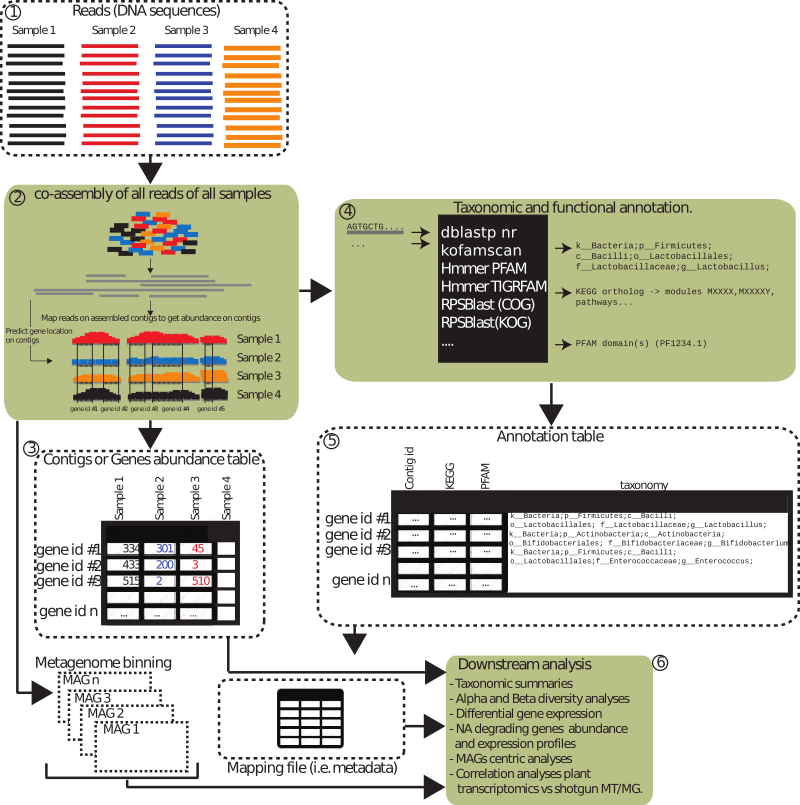
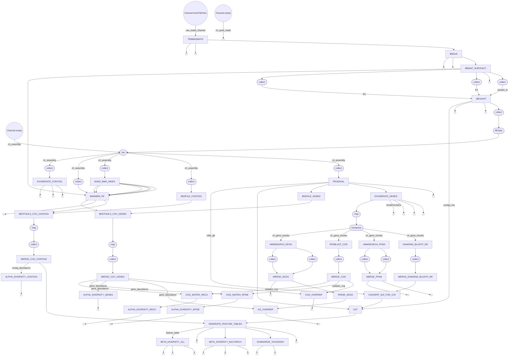

# ShotgunMG

This repository contains an implementation of the ShotgunMG pipeline (https://doi.org/10.1093/bib/bbac443) for Nextflow. The original pipeline implemented with the GenPipes workflow management system is available here: https://bitbucket.org/jtremblay514/nrc_pipeline_public. 

All the modules defined in the ```shotgunmg.config``` file should be installed and functional. The nrc_tools utilities can be found here: https://bitbucket.org/jtremblay514/nrc_tools_public . Briefly, this pipeline takes a set of raw reads (i.e. short Illumina reads), performs quality control and co-assemble the QC-controlled reads. These reads are then mapped against the co-assembly to generate contig and gene abundance matrices. The co-assembly is also processed through a gene caller (i.e. Prodigal). Resulting genes are functionally annotated using hmmsearch vs pfam; hmmsearch vs kofam and rpsblast vs COG. Taxonomic annotations are assigned using the CAT package. Finally, MAGs are generated using MetaBAT2. End results are included in the ```output/``` directory. Ultimately, this pipeline processes raw fastqs into gene and contig abundance matrices and functional and taxonomic annotation files.

A replicated simple mock community dataset is available here https://doi.org/10.5281/zenodo.7140751 and is a good dataset to test this pipeline. A fully functional implementation of the pipeline is available as a Docker image: https://cloud.docker.com/u/julio514/repository/docker/julio514/centos

This project is in development - more coming soon. 

```
###############################################################################
              _____ _           _                    __  __  _____ 
             / ____| |         | |                  |  \/  |/ ____|  
            | (___ | |__   ___ | |_ __ _ _   _ _ __ | \  / | |  __ 
             \___ \| '_ \ / _ \| __/ _` | | | | '_ \| |\/| | | |_ |
             ____) | | | | (_) | || (_| | |_| | | | | |  | | |__| |
            |_____/|_| |_|\___/ \__\__, |\__,_|_| |_|_|  |_|\_____|
                                    __/ |                          
                                   |___/    for N E X T F L O W 

                Github: https://github.com/jtremblay/ShotgunMG
             Home page: jtremblay.github.io/pipelines.html
               Version: 1.4.0-beta                                         
###############################################################################
```


*Figure 1. Overview of ShotgunMG.
1) Reads of each library are controlled for quality. 2) Quality controlled reads are co-assembled into one single de novo assembly. Gene coordinates are computed on each contig. Quality controlled reads are mapped on the co-assembly to estimate contig and gene abundance. 3) Contig and gene abundance are summarized into abundance matrices where columns = samples/liraries and rows = contig or gene identifiers. 4) Genes are annotated for taxonomy and functions and compiled on one single database (5). 6) These end results can then be used for downstream analyses.*

## Usage:
Once Nextflow (and an appropriate version of Java) is installed, you can run the pipeline like this:
```
nextflow run -c ./shotgunmg.config ./test5.nf -resume
```

In the ```shotgun.config``` file are all the parameters used for every steps of the pipeline. There you can customize the amounts of resources of each step, depending on this size and complexity of the dataset to analyze. The pipeline relies on environment modules (https://modules.readthedocs.io/en/latest/) which means that each software required by the pipeline have to be available through a module. For instance, for the co-assembly step, the MEGAHIT should be made available by first loading the module : (i.e. ```module load nrc/megahit/1.2.9```) and then running the software (i.e. ```megahit -h```).

## Databases
The pipeline relies on many databases in order to run the various annotations.

### CAT
Go here - https://github.com/dutilh/CAT - and follow the instructions under the preconstructed databases section,

### CheckM
Follow the instructions : https://github.com/Ecogenomics/CheckM

### COG
https://ftp.ncbi.nlm.nih.gov/pub/mmdb/cdd/little_endian/Cog_LE.tar.gz

### KOG 
https://ftp.ncbi.nlm.nih.gov/pub/mmdb/cdd/little_endian/Kog_LE.tar.gz

### NCBI nr
ftp://ftp.ncbi.nlm.nih.gov/blast/db/FASTA/nr.gz (Do not forget to run ```diamond makedb --in nr -p 4 --db nr.dmnd``` once downloaded).

### PFAM-A
Available here: http://ftp.ebi.ac.uk/pub/databases/Pfam. Use the latest version. May have to run ```hmmpress``` once downloaded.

### Contaminants
Available here: http://jtremblay.github.io/files/contaminants.tar.gz. Contains known Illumina contaminants, other sequencing artefacts and adapter sequences from  various kits (NexteraXT, TruSeq, etc.). In fasta format. 

### KEGG
KEGG orthologs (KO) assignment is done using kofamscan available here: https://www.genome.jp/ftp/tools/kofam_scan/kofam_scan-1.3.0.tar.gz. In order to run kofamscan, you will need to have the HMM profiles of each KO - available here: https://www.genome.jp/ftp/db/kofam/profiles.tar.gz - and also the KO link file - available here: https://www.genome.jp/ftp/db/kofam/ko_list.gz. Another file needed to link each KO to their associated pathway and/or module is available here: https://https://jtremblay.github.io/files/kegg_ref_pathways_modules_combined.tsv.gz.
Once downloaded, uncompress these files and move them into their location which should be $INSTALL_HOME/databases/kofam/<date>/. Double check their path in the .ini file under the [kofamscan] and [parse_kofam] sections.
KOfamscan generates lots of intermediate files which can actually make it impossible to use for large metagenomes. To circumvent this issue, you can concatenate all kofam individual profiles (```cat ./profiles/K* > kofam.hmm``` and run hmmpress ```hmmpress kofam.hmm```). Once done this kofam.hmm file can be used with the ```hmmsearch``` software - see KEGG section downstream. Our internal benchmarks showed that hmmsearch and kofamscan gave identical results (i.e. for both methods, each gene pointed to the same KO).


## Setting up files needed by the pipeline
The first step in running ShotgunMG is to setup the files required by the pipeline to run. Fastq libraries usually come in the form of demultiplexed paired end sequencing libraries - one library per sample. These ```.fastq.gz``` files should be stored in a directory labeled ```raw_reads/```.


## Diagram of the pipeline
Here is the Mermaid diagram of the pipeline.


